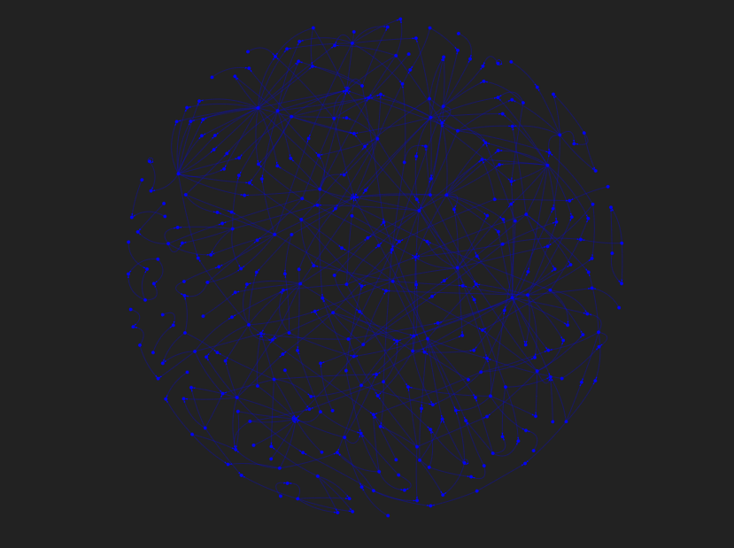

### Modules
Each module pulls citation information from a different data source. The currently availble modules are: \
 *  `EuroPMCRefGraph`: Uses the [Europe PMC Database](https://europepmc.org/)
 * `AlexRefGraph`: Uses the [OpenAlex Database](https://openalex.org/), implemented with [pyalex](https://github.com/J535D165/pyalex) (COMING SOON)
***
```
  _____       __  _____                 _     
 |  __ \     / _|/ ____|               | |    
 | |__) |___| |_| |  __ _ __ __ _ _ __ | |__  
 |  _  // _ \  _| | |_ | '__/ _` | '_ \| '_ \ 
 | | \ \  __/ | | |__| | | | (_| | |_) | | | |
 |_|  \_\___|_|  \_____|_|  \__,_| .__/|_| |_|
                                 | |          
                                 |_|
```

