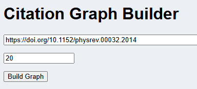
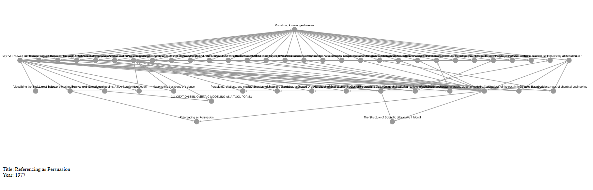

### Launching the App 
* Install all dependencies via `pip install -r requirements.txt`
* Start the app with `python app.py`
* Navigate to `127.0.0.1:8050` in your browser 

### Usage 
Paste a full DOI URL into the first box and a hard upper limit in the number of nodes to be incuded in the graph, as such: 


***
```
  _____       __  _____                 _     
 |  __ \     / _|/ ____|               | |    
 | |__) |___| |_| |  __ _ __ __ _ _ __ | |__  
 |  _  // _ \  _| | |_ | '__/ _` | '_ \| '_ \ 
 | | \ \  __/ | | |__| | | | (_| | |_) | | | |
 |_|  \_\___|_|  \_____|_|  \__,_| .__/|_| |_|
                                 | |          
                                 |_|
```

